# Liquio Architecture

Liquio is a microservices platform. Each deployable unit lives under
[`components/`](components/) and is packaged by the umbrella
[Helm chart](helm-chart/). Shared code (not independently deployed) lives
under `packages/`.

## Deployment model

Liquio is designed to run on **Kubernetes** (see [CONTRIBUTING.md § Kubernetes Setup](CONTRIBUTING.md#kubernetes-setup)),
deployed via the umbrella [Helm chart](helm-chart/) described throughout
this document (ingress, network policies, per-service toggles, data-layer
configuration). For **local development**, the same set of services is
brought up with [`docker-compose.yml`](docker-compose.yml) — see
[CONTRIBUTING.md § Docker Compose Setup](CONTRIBUTING.md#docker-compose-setup) —
which wires up the equivalent Postgres/RabbitMQ/Redis dependencies without
Kubernetes. The two are kept in sync but are not identical — e.g.
Kubernetes-only concerns like Ingress hostnames and NetworkPolicy tiers
have no docker-compose equivalent.

## Services

| Service | Role |
|---|---|
| `id-api` / `id-front` | Identity provider — accounts, auth, sessions; issues tokens used by every other API |
| `admin-api` / `admin-front` | Back-office: workflow (BPMN) designer, user/register management, stats, config |
| `cabinet-api` / `cabinet-front` | Citizen/business "personal cabinet" — thin auth layer that mostly proxies to `task` |
| `task` | Core business-logic engine: runs BPMN task instances, forms, signing, register/document integration |
| `manager` | BPMN orchestration hub — routes workflow messages between `task`, `event`, `gateway` over RabbitMQ |
| `gateway` | BPMN gateway node processor — evaluates parallel/exclusive gateway logic within workflow execution, driven off RabbitMQ |
| `event` | Event/integration engine: external callbacks, X-Road gov data exchange, delayed jobs |
| `register` | Registry / reference-data storage (structured records, search, import-export) |
| `notification` | Notification dispatch (email/SMS/push) and templates |
| `sign-tool` | Digital signature / cryptographic (x509) operations |
| `pdf-generator` | HTML → PDF rendering |
| `filestorage` | File upload/storage, backed by Postgres **or** S3-compatible object storage (see below) |
| `persist-link` | Persistent/shareable document links |
| `external-reader` | Plugin-based reader/aggregator for external systems and registries, reached directly or via X-Road |

## Externally exposed services

A single umbrella Ingress ([`helm-chart/templates/shared/ingress.yaml`](helm-chart/templates/shared/ingress.yaml),
driven by `values.yaml: ingress.hosts`) exposes only the user-facing
front/API pairs:

- `id.liquio.local` → `id-front`, `id-api.liquio.local` → `id-api`
- `admin.liquio.local` → `admin-front`, `admin-api.liquio.local` → `admin-api`
- `cabinet.liquio.local` → `cabinet-front`, `cabinet-api.liquio.local` → `cabinet-api`
- `plink.liquio.local` → `persist-link`

Everything else (`task`, `manager`, `gateway`, `event`, `register`,
`notification`, `sign-tool`, `pdf-generator`, `filestorage`,
`external-reader`) is ClusterIP-only and reachable exclusively from other
services inside the cluster. Network policies in the chart
(`values.yaml: networkPolicy`, `helm-chart/templates/shared/networkpolicy.tpl`)
enforce this in four tiers: `frontend` (ingress-only), `backend` (ingress +
intra-namespace), `infra`, and a `gateway` tier applied specifically to the
`gateway` component, granting it egress to all backend-tier pods — a
network-policy allowance, not evidence that `gateway` actually calls every
backend service (see its real role below).

> Note: the ingress `serviceMap` only names ports for the six
> front/API pairs above; the `plink` host resolves against a service name
> that doesn't match the real `persist-link` Service object
> (`helm-chart/templates/core-services/persist-link.service.yaml`) unless
> overridden — worth reconciling if that route is relied on.

## Data layer

Shared infrastructure, each independently toggleable in the chart
(`values.yaml`: `postgresql.enabled`, `rabbitmq.enabled`, `redis.enabled`)
so a deployment can point at externally managed instances instead:

- **PostgreSQL** — primary datastore for nearly every service, one
  Postgres instance hosting several databases (`config-templates/*/db.json`,
  migration jobs on deploy). Most databases are one-per-service (`id`,
  `register`, `notify`, `filestorage`, `persist_link`), but `admin-api`,
  `cabinet-api`, `task`, `manager`, `gateway`, and `event` all share a
  single `bpmn` database.
- **RabbitMQ** — the BPMN workflow message bus, not generic pub/sub. Fixed
  queues (`bpmn-manager-incoming`, `bpmn-task-incoming`,
  `bpmn-event-incoming`, `bpmn-gateway-incoming`) are consumed/produced by
  `manager`, `task`, `event`, `gateway`, and `admin-api`, with `manager` as
  the sole consumer of `bpmn-manager-incoming` and fan-out point to the
  others.
- **Redis / Dragonfly** — caching/session store for `id-api`, `admin-api`,
  `cabinet-api`, `manager`, `event`, `gateway` (disabled by default for
  `task` and `register`). The chart ships a vanilla `redis` image, but
  production deployments have been observed running **Dragonfly** as a
  Redis-protocol-compatible drop-in — treat "Redis" here as "Redis wire
  protocol", not a specific engine.

### `filestorage`: dual storage backend

`filestorage` can store file bytes directly in Postgres (`data`/`preview`
`BYTEA` columns) or delegate to an S3-like object store, selected by a
single config flag rather than per file:

- `providers.json: activeProvider = null` → store in Postgres.
- `activeProvider = "minio"` → MinIO / any S3-compatible endpoint
  (bucket + credentials).
- `activeProvider = "openstack"` → OpenStack Swift object store
  (auth v3, tenant, container, credentials).

## `admin-api` / `cabinet-api` as proxies to `task`

Both are user-facing APIs that sit in front of the `task` service, but
proxy differently:

- **`cabinet-api`** is mostly a thin auth gateway: anything not matched by
  its own routes is forwarded wholesale via `express-http-proxy` to
  `discovery.mainProxy` (`http://task:3000`,
  `config-templates/cabinet-api/discovery.json`). It also supports a
  configurable list of additional proxy targets (`discovery.customApis`).
- **`admin-api`** proxies selectively: a `TaskService` client
  (`components/admin-api/src/services/task.ts`) calls specific `task`
  routes (`/workflow-logs`, `/workflows/elastic-filtered`, `/unit-access`,
  `/register/cache`, `/test/ping[/services]`), plus a dedicated
  `/register-proxy/admin` route to `register`
  (`components/admin-api/src/services/router.ts`), and a generic
  configurable reverse proxy (`config-templates/admin-api/proxy.json`).

`register` itself has no ingress and is never called directly by citizens
or businesses. Its record-management methods are exposed externally
through `task`: `task` implements its own `/register/...` REST endpoints
(`components/task/src/controllers/register.ts`) whose handlers call out to
the internal `register` service (`components/task/src/services/register.ts`,
`config-templates/task/register.json` → `http://register:3350`). Since
`cabinet-api` proxies unmatched requests wholesale to `task`, citizens and
businesses reach register data via the chain
`cabinet-api → task → register`, not by calling `register` directly. This
indirection exists so that `task` — which knows the requesting user's
unit/role and the current BPMN process/workflow context — can resolve and
enforce user- and process-level access permissions (per-unit
allow-read/create/update/delete/history rules,
`config-templates/task/register.json: access`) before the request reaches
`register`; `task` attaches the resolved `access-info` to every call
(`components/task/src/services/register.ts`). `register` has no visibility
into workflow context on its own, so it cannot enforce these permissions
itself.

## Cross-service connections

Derived from per-service config templates (`config-templates/*/*.json`) and
service/router source. Synchronous HTTP unless noted.

- `admin-front` → `admin-api`, `cabinet-front` → `cabinet-api`,
  `id-front` → `id-api` (browser-facing, via ingress)
- `admin-api` → `id-api` (auth), `notification`, `register` (+ dedicated
  proxy route), `task` (see above), `filestorage`, `sign-tool`
- `cabinet-api` → `id-api` (auth), `task` (catch-all proxy)
- `task` → `id-api`, `sign-tool`, `external-reader`, `notification`,
  `pdf-generator`, `persist-link`, `filestorage`, `register`; health-checks
  fan out to nearly every other service (`config-templates/task/ping.json`)
- `id-api` → `sign-tool`, `notification`
- `notification` → `id-api`
- `register` → `sign-tool`
- `event` → `task`, `filestorage`, `persist-link`, `notification`,
  `register`, `id-api`, `sign-tool`, **X-Road** (external gov
  data-exchange integration), and external third-party APIs directly
- `external-reader` → external APIs / registries, either directly or via
  **X-Road**
- `filestorage` → external object storage (MinIO / OpenStack), when enabled
- RabbitMQ (async, BPMN bus): `admin-api`, `manager`, `task`, `event`,
  `gateway` all publish/consume `bpmn-*-incoming` queues, with `manager` as
  the central router
- `admin-api` → `admin-front`: an optional, dev-only WebSocket debug-log
  stream (`components/admin-api/src/lib/logs_broadcasting.ts`, gated by
  admin auth and disabled by default) — not a general-purpose push channel

## C4 container diagram

```mermaid
C4Container
    title Liquio — Container Diagram

    Person(citizen, "Citizen / Business user")
    Person(official, "Government official", "Usually uses cabinet; sometimes granted admin access")
    Person(admin, "Platform administrator")

    Enterprise_Boundary(liquio, "Liquio Platform") {
        Container_Boundary(external, "Externally exposed (via Ingress)") {
            Container(id_front, "id-front", "SPA", "Login / identity UI")
            Container(admin_front, "admin-front", "SPA", "Admin console, workflow designer")
            Container(cabinet_front, "cabinet-front", "SPA", "Citizen personal cabinet UI")

            Container(id_api, "id-api", "Node.js", "Identity provider: accounts, auth, sessions")
            Container(admin_api, "admin-api", "Node.js", "Back-office API; selective proxy to task")
            Container(cabinet_api, "cabinet-api", "Node.js", "Citizen-facing API; catch-all proxy to task")
            Container(persist_link, "persist-link", "Node.js", "Shareable persistent document links")
        }

        Container_Boundary(internal, "Internal-only (ClusterIP)") {
            Container_Boundary(bpmn, "BPMN") {
                Container(task, "task", "Node.js", "Core workflow/business-logic engine")
                Container(manager, "manager", "Node.js", "BPMN orchestration hub")
                Container(gateway, "gateway", "Node.js", "BPMN gateway node processor")
                Container(event, "event", "Node.js", "External integrations, callbacks, X-Road")
            }
            Container(register, "register", "Node.js", "Registry / reference-data store")
            Container(notification, "notification", "Node.js", "Email/SMS/push dispatch")
            Container(sign_tool, "sign-tool", "NestJS", "Digital signature (x509) operations")
            Container(pdf_generator, "pdf-generator", "NestJS", "HTML to PDF rendering")
            Container(filestorage, "filestorage", "Node.js", "File storage: DB or S3-compatible")
            Container(external_reader, "external-reader", "Node.js", "Plugin-based external data reader")
        }

        ContainerDb(postgres, "PostgreSQL", "Database", "Primary datastore; multiple databases, incl. a shared 'bpmn' database")
        ContainerQueue(rabbitmq, "RabbitMQ", "Message bus", "BPMN workflow message bus")
        ContainerDb(redis, "Redis / Dragonfly", "Cache", "Cache & session store")
    }

    System_Ext(xroad, "X-Road", "External gov data exchange")
    System_Ext(external_apis, "External APIs / registries", "Third-party & government systems")
    System_Ext(objectstore, "MinIO / OpenStack", "S3-compatible object storage")

    Rel(citizen, cabinet_front, "Uses", "HTTPS")
    Rel(citizen, id_front, "Logs in via", "HTTPS")

    Rel(official, cabinet_front, "Uses", "HTTPS")
    Rel(official, admin_front, "Occasionally uses (if granted access)", "HTTPS")
    Rel(official, id_front, "Logs in via", "HTTPS")

    Rel(admin, admin_front, "Uses", "HTTPS")
    Rel(admin, id_front, "Logs in via", "HTTPS")

    Rel(cabinet_front, cabinet_api, "Calls", "HTTPS/REST")
    Rel(admin_front, admin_api, "Calls", "HTTPS/REST")
    Rel(id_front, id_api, "Calls", "HTTPS/REST")

    Rel(admin_api, id_api, "Verifies auth", "HTTP")
    Rel(cabinet_api, id_api, "Verifies auth", "HTTP")
    Rel(admin_api, task, "Calls specific routes", "HTTP")
    Rel(cabinet_api, task, "Proxies wholesale", "HTTP")
    Rel(admin_api, register, "Proxies", "HTTP")
    Rel(admin_api, notification, "Sends", "HTTP")
    Rel(admin_api, filestorage, "Uses", "HTTP")
    Rel(admin_api, sign_tool, "Uses", "HTTP")

    Rel(task, id_api, "Verifies auth", "HTTP")
    Rel(task, sign_tool, "Signs documents", "HTTP")
    Rel(task, filestorage, "Stores files", "HTTP")
    Rel(task, register, "Reads/writes records", "HTTP")
    Rel(task, notification, "Sends", "HTTP")
    Rel(task, pdf_generator, "Renders PDFs", "HTTP")
    Rel(task, persist_link, "Creates links", "HTTP")
    Rel(task, external_reader, "Reads external data", "HTTP")

    Rel(id_api, sign_tool, "Uses", "HTTP")
    Rel(id_api, notification, "Sends", "HTTP")
    Rel(notification, id_api, "Looks up users", "HTTP")
    Rel(register, sign_tool, "Signs", "HTTP")

    Rel(event, task, "Triggers workflows", "HTTP")
    Rel(event, filestorage, "Uses", "HTTP")
    Rel(event, persist_link, "Uses", "HTTP")
    Rel(event, notification, "Uses", "HTTP")
    Rel(event, register, "Uses", "HTTP")
    Rel(event, id_api, "Uses", "HTTP")
    Rel(event, sign_tool, "Uses", "HTTP")
    Rel(event, xroad, "Exchanges gov data", "SOAP/X-Road")
    Rel(event, external_apis, "Calls directly", "HTTP/SOAP")
    Rel(external_reader, external_apis, "Reads directly, or via X-Road", "HTTP/SOAP")
    Rel(external_reader, xroad, "Reads via", "SOAP/X-Road")

    Rel(filestorage, objectstore, "Stores files", "S3 API (optional)")

    Rel(manager, rabbitmq, "Routes BPMN messages", "AMQP")
    Rel(task, rabbitmq, "Publishes/consumes", "AMQP")
    Rel(event, rabbitmq, "Publishes/consumes", "AMQP")
    Rel(gateway, rabbitmq, "Publishes/consumes", "AMQP")
    Rel(admin_api, rabbitmq, "Publishes/consumes", "AMQP")
    Rel(admin_api, admin_front, "Streams debug logs (dev-only, opt-in)", "WebSocket")

    Rel(id_api, postgres, "Reads/writes")
    Rel(admin_api, postgres, "Reads/writes")
    Rel(cabinet_api, postgres, "Reads/writes")
    Rel(task, postgres, "Reads/writes")
    Rel(manager, postgres, "Reads/writes")
    Rel(register, postgres, "Reads/writes")
    Rel(event, postgres, "Reads/writes")
    Rel(gateway, postgres, "Reads/writes")
    Rel(notification, postgres, "Reads/writes")
    Rel(filestorage, postgres, "Reads/writes (default backend)")
    Rel(persist_link, postgres, "Reads/writes")

    Rel(id_api, redis, "Caches")
    Rel(admin_api, redis, "Caches")
    Rel(cabinet_api, redis, "Caches")
    Rel(manager, redis, "Caches")
    Rel(event, redis, "Caches")
    Rel(gateway, redis, "Caches")
```

## Key files

- [`helm-chart/values.yaml`](helm-chart/values.yaml) — service list, ingress hosts, data-layer toggles
- [`helm-chart/templates/shared/ingress.yaml`](helm-chart/templates/shared/ingress.yaml) — ingress routing
- [`docker-compose.yml`](docker-compose.yml) — local dev topology
- [`config-templates/`](config-templates/) — per-service inter-service URLs (richest source for cross-service edges)
- [`components/filestorage/src/providers/`](components/filestorage/src/providers/) — DB vs. S3-compatible storage backends
- [`components/cabinet-api/src/router.ts`](components/cabinet-api/src/router.ts) — catch-all proxy to `task`
- [`components/admin-api/src/services/task.ts`](components/admin-api/src/services/task.ts) — selective proxy to `task`
